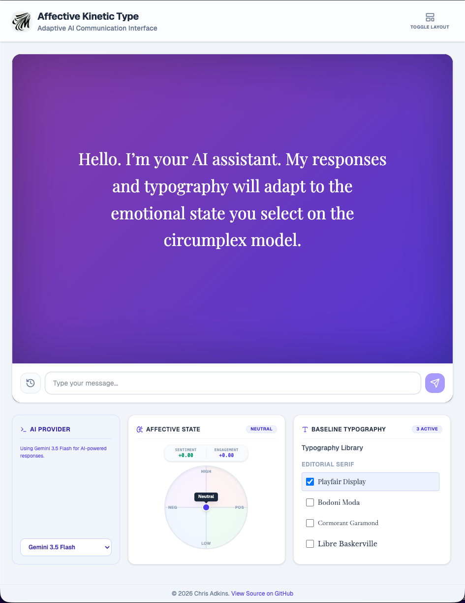

<p align="center">
  
</p>

# Affective Kinetic Type

An interactive, highly visual AI chat application that transforms conversations into responsive cinematic experiences using kinetic typography, adaptive layouts, and context-aware environments. Powered by Google’s Gemini AI, the system analyzes emotional tone, engagement, pacing, and conversational context to dynamically animate text, adjust interface behavior, and evolve the surrounding environment in real time.

⸻

## 🌟 Key Features

### ✨ Kinetic Typography

Words dynamically animate, scale, shift, and respond to the emotional characteristics of the AI response. Calm responses appear stable and restrained, while energetic or emotionally charged responses become more expressive and animated.

### 🌦️ Dynamic Environmental Backgrounds

The interface reacts to conversational context with immersive animated environments. Discussions involving rain, snow, fog, sunlight, storms, or atmospheric conditions automatically trigger corresponding visual effects and lighting changes.

### 📱 Fully Responsive Interface

The application is designed to adapt seamlessly across desktop, tablet, and mobile devices. Layout behavior, typography scaling, control positioning, and interaction patterns adjust dynamically for different screen sizes and orientations.

### 🎛️ Five Control Panel Layout Modes

Users can reposition the control panel to match different workflows and screen configurations. Layout modes include:

* Left Sidebar
* Right Sidebar
* Bottom Dock
* Floating Panel
* Compact Overlay

Each layout is optimized for usability while preserving visibility of the AI response area.

### 💬 Persistent Conversation History

User-submitted messages and AI responses are stored in an ongoing conversation history, allowing the interface to maintain contextual continuity across exchanges and preserve conversational flow.

### 🧠 Conversation Mode

Responses are segmented and delivered sequentially with timed transitions, creating a more natural conversational cadence and improving readability for long-form responses.

### ♿ Accessibility First

Built-in WCAG compliance controls (A, AA, AAA). Accessibility strictness can limit animation intensity, enforce safe contrast ratios, and reduce visual distraction while preserving the expressive qualities of the interface.

### 🎨 Granular Interface Controls

A comprehensive control system allows users to customize:

* Typography
* Animation intensity
* Emotional influence
* Layout behavior
* Accessibility strictness
* Environmental responsiveness
* Visual density

⸻

## 💡 How to Use

### Start a Conversation
Type a message into the chat input at the bottom of the interface.

### Watch the Interface Respond
Observe how typography, pacing, and environmental effects react dynamically to the emotional tone and context of the conversation.

### Change the Environment
Discuss different environments, weather conditions, or emotional atmospheres to trigger adaptive background transitions and kinetic effects.

### Adjust the Layout
Switch between the five control panel layouts to optimize the experience for your device, workflow, or preferred interaction style.

### Customize the Experience
Open the Control Panel to modify fonts, animation behavior, accessibility strictness, environmental effects, and interface responsiveness.

⸻

## 🚀 Getting Started

Follow these instructions to set up and run the project locally.

### Prerequisites

* Node.js (v18 or higher recommended)
* npm (Node Package Manager)

### Installation

1. **Clone the Repository**
   ```bash
   git clone https://github.com/webpmp/Affective-Kinetic-Type.git
   cd affective-kinetic-type
   ```

2. **Install Dependencies**
   ```bash
   npm install
   ```

3. **Set Up Environment Variables**
   Copy the `.env.example` file to a new file named `.env`.

   #### Google Gemini
   If you plan to use Google Gemini, add your API key:
   ```env
   GEMINI_API_KEY=your_api_key_here
   ```

   #### Local AI with LM Studio
   The application also supports running a local AI model through LM Studio.

   1. Install and launch LM Studio.
   2. Download and load a compatible model.
   3. Start the OpenAI Compatible Server in LM Studio.
   4. Open the application’s Settings panel.
   5. Set AI Provider to LM Studio.

   No changes to the `.env` file are required when using LM Studio. Once the OpenAI Compatible Server is running and AI Provider is set to LM Studio, all AI requests will be sent to your local model instead of Google Gemini.

4. **Start the Development Server**
   ```bash
   npm run dev
   ```

5. **Open the Application**
   Visit `http://localhost:3000` in your browser to begin interacting with the system.

⸻

## 🛠️ Technologies Used

* React (with Vite)
* Tailwind CSS
* Framer Motion
* Google GenAI SDK (`@google/genai`)
* Lucide React

⸻

## 🧩 Core Interface Systems

* Responsive Layout Engine
* Kinetic Typography Renderer
* Sentiment & Engagement Analysis
* Dynamic Environmental Effects
* Accessibility Compliance Layer
* Sequential Conversation Delivery
* Persistent Conversation History
* Adaptive Control Panel System

⸻

## 📌 Project Vision

Affective Kinetic Type explores how conversational AI interfaces can become emotionally expressive, spatially adaptive, and visually kinetic without sacrificing readability, accessibility, or usability.

The system treats typography, motion, layout, pacing, and environmental effects as active components of communication rather than passive interface decoration. Every response is designed to feel responsive, atmospheric, and contextually aware while remaining readable and user-controlled.

The project combines:

* Emotional analysis
* Responsive interface systems
* Cinematic motion design
* Adaptive environmental rendering
* Accessibility-first interaction design
* Real-time conversational presentation

The result is a unified AI communication experience that reacts dynamically to both content and user interaction.

Rather than presenting AI responses as static blocks of text, Affective Kinetic Type transforms conversation into a living visual system where language, motion, atmosphere, and interface behavior work together to reinforce meaning and emotional tone.
